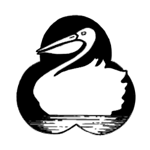

<!-- Header -->

   

  <!-- Logo -->
  

  <!-- Title -->
  ### Pelican Landing

  <!-- Description -->
  Morson's Pelican Landing Website

  <!-- Repo badges -->
  
  
  

  <!-- Links -->

  ---
  

    <a href="https://git.zakscode.com/ztimson/pelican-landing/releases" target="_blank">Release Notes</a>
    • <a href="https://git.zakscode.com/ztimson/pelican-landing/issues/new?template=.github%2fissue_template%2fbug.md" target="_blank">Report a Bug</a>
    • <a href="https://git.zakscode.com/ztimson/pelican-landing/issues/new?template=.github%2fissue_template%2fenhancement.md" target="_blank">Request a Feature</a>
  

  ---

## Table of Contents
- [Pelican Landing](#top)
	- [About](#about)
		- [Demo](#demo)
		- [Built With](#built-with)
	- [Setup](#setup)
		- [Production](#production)
		- [Development](#development)
	- [License](#license)

## About

This is a business website built for Pelican Landing.

Pelican Landing is a family run year-round hunting & fishing lodge. It's located on the beautiful southern shores of Lake of Woods and offers the outdoors-man a tailor made experience. With both road and water access this resort can meet the needs of the angler, hunter, or nature enthusiast.

### Demo

Website: https://pelica-landing.zakscode.com

### Built With

## Setup

  <h3 id="production" style="display: inline">
    Production
  </h3>

#### Prerequisites
- [Docker](https://docs.docker.com/install/)

#### Instructions
1. Run the docker image: `docker run -p 80:80 git.zakscode.com/ztimson/pelican-landing:latest`
2. Open [http://localhost](http://localhost)

  <h3 id="development" style="display: inline">
    Development
  </h3>

#### Prerequisites
- [Node.js](https://nodejs.org/en/download)

#### Instructions
1. Install the dependencies: `npm install`
2. Start the Angular server: `npm run start`
3. Open [http://localhost:4200](http://localhost:4200)

## License
Copyright © 2023 Zakary Timson | All Rights Reserved

See the [license](./LICENSE) for more information.
